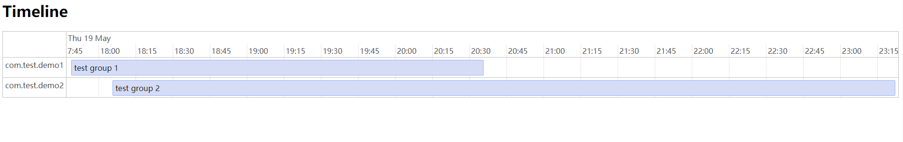

# TimelineCreator
This is a Creator for Timeline or Gantt by Python. ——2022.05.18

Use [vis-timeline](https://github.com/visjs/vis-timeline) to draw the chart. ——2022.05.25

## Demo chart



## Getting Started

#### CMD run this:

```shell
python mk_data.py
python mk_html.py
start  ./dist/timeline_chart.html
```

## How to create a Timeline HTML with your data:

**mk_data.py** can create a temporary **data.json** file to debug.

Otherwise, you can create a similar file or python dict like that.

Your data should like this:

```python
data = {
    "groups": [
        {"id": 1, "content": "com.test.demo1"},
        {"id": 2, "content": "com.test.demo2"}
    ],
    "items": [
        {
            'group': 1,
            'id': 1,
            'content': 'test group 1',
            'start': ms_str_2_date("1652953734"),
            'end': ms_str_2_date("1652963734")
        },
        {
            'group': 2,
            'id': 2,
            'content': 'test group 2',
            'start': ms_str_2_date("1652954734"),
            'end': ms_str_2_date("1652973734")
        },
    ]
}
```